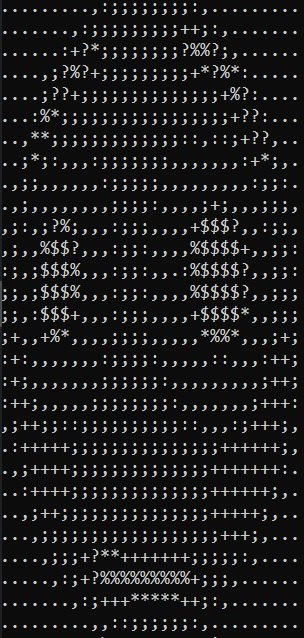

# ASCII-Photo
Very simple "program" that allows you to convert images to ASCII characters in C++ using https://github.com/nothings/stb (specifically: stb_image.h and stb_image_resize.h)

## Quick start (Windows with g++)
### `Build`:
```console
PATH\TO\FILES> build
```
### `Run`:
```console
PATH\TO\FILES> main
```

## Instructions
After running the console "program" you will be prompted to input the path to your image, example:
```console
Specify path to image (with extension): photos/flushed.png
```
*Note: If the path contains spaces surround  it with quotation marks: "example path/image.jpg"*

After that your image will be displayed as ASCII characters.

